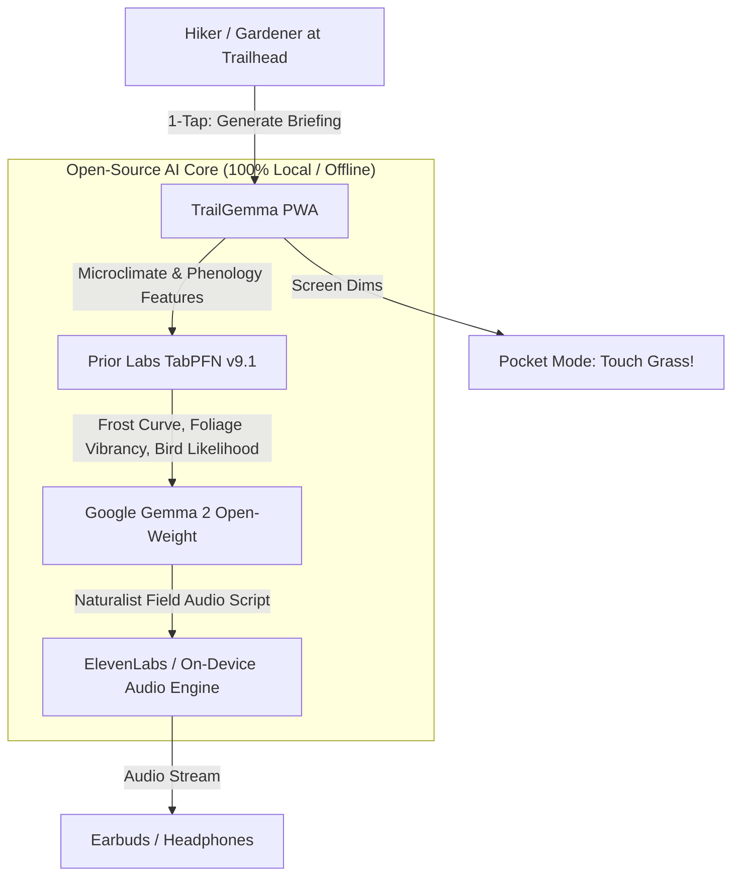

# 🌿 TrailGemma & FloraCast: The Zero-Screen Offline Nature Companion

> **Built for the Hacktoberfest Open-Source AI Challenge Week 1: "Touch Grass"**  
> *Targeting Categories: Grand Prize | Best Use of Gemma ($200) | Best Use of TabPFN ($200) | Best Use of ElevenLabs ($100)*

[](https://dev.to/challenges/hacktoberfest-week1-2026-10-05)
[-38bdf8?style=for-the-badge)](https://ai.google.dev/gemma)
[](https://docs.priorlabs.ai/)
[](https://elevenlabs.io/)
[](#)

---

## 🍃 What It Is

Most AI applications want your attention glued to the glass. **TrailGemma** does the exact opposite: **it makes the screen the shortest part of the experience.**

Whether you are standing at an off-grid mountain trailhead with zero cellular bars or checking your backyard raised beds on a chilly autumn morning, TrailGemma gives you a **45-second audio field briefing**, then tells you to **pocket your phone, pop in your earbuds, and touch grass.**

Powered entirely by open-source AI:
1. **Google Gemma 2 (2B Open-Weight)**: Runs locally on your machine or edge device via Ollama. Acts as your wilderness naturalist, foraging safety guide, and poetic audio tour scriptwriter.
2. **Prior Labs TabPFN (Tabular Foundation Model v9.1)**: Runs zero-shot Bayesian in-context prediction over microclimate datasets. Predicts microclimate frost risk, soil temperatures, fall foliage canopy vibrancy, and songbird occurrence likelihood without parameter fine-tuning.
3. **ElevenLabs & Offline Audio Engine**: Converts synthesized trail briefings into natural spoken audio. Includes an offline Web Speech API fallback so you can hike deep into signal-free national forests without missing a beat.

---

## 🗺️ Key Features

### 1. 🍁 Fall Foliage & Run Club Scout
* **Canopy Coloration Phenology**: TabPFN analyzes elevation lapse rates, latitude, accumulated chilling hours, and species mix (sugar maple, red oak, aspen/birch) to predict peak foliage vibrancy (0–100%).
* **Trailhead Briefing**: Instant recommendations for local running loops, golden-hour photo timing, and leaf carpet conditions.

### 2. 🌱 Backyard Frost & Garden Planner ("Touch Soil This Weekend")
* **Microclimate Frost Curve**: Replaces inaccurate, county-wide zip code frost averages with localized physics-informed predictions based on elevation, slope aspect (solar absorption), distance to water (thermal buffering), and nighttime lows.
* **Actionable Autumn Checklist**: Exact guidance on what to plant today (winter garlic, hardy spinach, fava beans) versus what tender crops to harvest before nightfall (tomatoes, basil, peppers).

### 3. 🐦 Trail Whisperer: Bio-Acoustic Bird Occurrence
* **Sub-Canopy Phenology**: Predicts which bird species are actively vocalizing at your current elevation, ambient temperature, canopy density, and time of day (e.g. Hermit Thrush, Pileated Woodpecker, Belted Kingfisher).
* **Listening Protocol**: Encourages hikers to pause for 60 seconds on the trail, pocket the screen, and listen for acoustic cues.

### 4. 📱 The "Touch Grass" Protocol & Pocket Mode
* **Pocket Mode**: A single tap activates a low-power, pitch-black screen with a subtle breathing indicator and timer while your audio guide plays. Prevents accidental screen touches in your pocket or running belt.
* **Grass Time Counter**: Real-time ticker tracking your actual minutes spent outdoors off your screen.
* **☀️ High-Contrast Sunlight Mode**: One-click contrast inversion designed specifically for high-glare direct sunlight at outdoor trailheads.

---

## 🏗️ System Architecture



---

## 💡 Why Open Innovation Matters

Closed-source proprietary APIs fail when you're 4 miles deep into a mountain ridge:
1. **Zero Cellular Signal on the Trail**: Commercial cloud AI models are completely useless when you have no signal. Gemma 2 and TabPFN run **100% locally on your laptop or edge device with zero internet access**.
2. **Absolute Privacy**: Your GPS coordinates, trail logs, and private garden layouts never leave your hardware. No tracking, no cloud telemetry, no data harvesting.
3. **Zero Cost & Infinite Runs**: You can recompute foliage curves, simulate microclimates, and generate dozens of audio briefings without worrying about credit exhaustion or monthly API billing.
4. **Predictive Tabular Power (TabPFN)**: Unlike closed LLMs that hallucinate tabular figures or require brittle prompt engineering, TabPFN is a foundation model purpose-built for tabular data, delivering calibrated Bayesian prediction in milliseconds.

---

## 🚀 Quickstart & Installation

### Prerequisites
- Python 3.10+
- [Ollama](https://ollama.com/) (installed and running)

### 1. Clone & Setup
```bash
git clone https://github.com/your-username/trailgemma.git
cd trailgemma

# Install Python dependencies
pip install fastapi uvicorn tabpfn torch pandas numpy httpx
```

### 2. Pull Local Google Gemma 2
```bash
ollama pull gemma2:2b
```

### 3. (Optional) ElevenLabs API Key
If you want cloud-synthesized voices in addition to local audio:
```bash
export ELEVENLABS_API_KEY="your_api_key_here"
```

### 4. Launch TrailGemma
```bash
./scripts/run_demo.sh
```
Open **[http://localhost:8000](http://localhost:8000)** in your browser!

---

## 🧪 Testing the APIs

You can also interact directly with the FastAPI endpoints:

```bash
# Test System Status & Open AI Engines
curl http://127.0.0.1:8000/api/status

# Test TabPFN Microclimate Frost Predictor
curl -X POST http://127.0.0.1:8000/api/predict/frost \
  -H "Content-Type: application/json" \
  -d '{"elevation_m": 350, "dist_water_km": 4.0, "slope_aspect_deg": 180, "canopy_cover_pct": 20, "avg_night_temp_c": 1.5, "soil_moisture_pct": 35, "day_of_autumn": 45}'

# Test 60-Second Audio Briefing Synthesis (TabPFN + Gemma 2)
curl -X POST http://127.0.0.1:8000/api/briefing/generate \
  -H "Content-Type: application/json" \
  -d '{"trail_id": "sugarloaf-ridge", "hour_of_day": 8.0, "day_of_year": 282}'
```

---

## 🏆 Hacktoberfest Prize Categories

* **Grand Prize**: Relevant to the "Touch Grass" prompt, making the screen the shortest part of the experience.
* **Best Use of Gemma ($200)**: Google's open-weight model `gemma2:2b` runs locally via Ollama to generate conversational naturalist advice and poetic audio tour scripts.
* **Best Use of TabPFN ($200)**: Prior Labs' tabular foundation model `TabPFNClassifier` and `TabPFNRegressor` predict microclimate frost risk, soil temperature, foliage coloration, and bird acoustics from environmental features.
* **Best Use of ElevenLabs ($100)**: Generates field audio briefings so the user can listen hands-free while hiking with earbuds in Pocket Mode.

---

*Now shut your laptop, lace up your boots, and touch grass! 🌿*
# trailgemma
